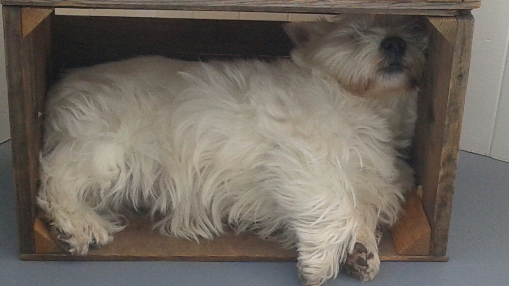

# Final Project

Contains final project and all previous labs to be instantiated within final:
* lab1
* lab2
* lab3
* lab4
* lab5
* final project

# Files/Folders

## lab1

### files included in lab 4

  * inst_mem.mif
  * inst_mem.vhd
  * inst_mem.qip
  * register8.vhd
  * programCounter.vhd
  * instruction_fetch.vhd

## lab2

### files included in lab4

  * logicShift.vhd
  * fullader.vhd
  * ALU_64.vhd
  * addsub.vhd

## lab3

### files included in lab4

  * risc_v_decoder.vhd
  * register_file.vhd

## lab4

  * ALU_control
  * control_unit
  * imm_gen.vhd
  * datapath.vhd
  * datapath_test.vhd

## lab5

  * datapath.vhd
  * datapath_test.vhd

## final project

### Folders

#### datapath1

  * datapath.vhd
  * datapath_test.vhd
  * EXE_reg.vhd
  * IF_reg.vhd
  * MEM_reg.vhd

  Fully piplined datapath

#### datapath2

  * datapath.vhd
  * datapath_test.vhd
  * IF_reg.vhd
  * forwarding_unit.vhd

  Fully piplined datapath with data forwarding

#### dynamic_datapath

  * datapath.vhd
  * datapath_test.vhd
  * dynamic_prediction_unit.vhd

  Dynamic 2bit branch prediction

  Uses data forwarding unit from datapath2

  Uses stage registers from static_datapaths

  Uses pre RD reg components from static_datapaths

  Benchmark general instructions list

##### fewbranches

  * datapathfew.vhd
  * datapathfew_test.vhd

  Benchmark with few branches taken

  Uses .mif from static few taken

##### manybranches

  * datapathmany.vhd
  * datapathmany_test.vhd

  Benchmark with many branches taken

  Uses .mif from static many branches

#### static_datapaths

  * datapath.vhd
  * datapath_test.vhd
  * RD_reg.vhd
  * IF_reg.vhd
  * register_file.vhd
  * static_prediction_unit.vhd
  * instruction_fetch.vhd
  * early_forwarding.vhd

  Static branch prediction, both never taken and always taken

  Benchmark general instruction set

##### experiment

###### fewbranches

  * datapathfew.vhd
  * datapathfew_test.vhd
  * inst_mem.mif
  * inst_mem.vhd

  Benchmark with few branches taken

###### manybranches

  * datapathmany.vhd
  * datapathmany_test.vhd
  * inst_mem.mif
  * inst_mem.vhd

  Benchmark with many branches taken

#### project_files

  Provided project files

#### emulation

  * datapath.bsf
  * datapath.vhd

  Datapath2 copy with ports for emulation

### Files

  * Waveform
  * control_EXE_reg.vhd
  * control_IF_reg.vhd
  * control_RD_reg.vdh
  * EXE_reg.vhd
  * MEM_reg.vhd
  * RD_reg.vhd

  General purpose registers to colntol statges in pipeline

### Reports

  * AppendixB.docx
  * Appendix C.pdf
  * experimentdata.rmd

Today one of the dogs fell asleep in an apple box

